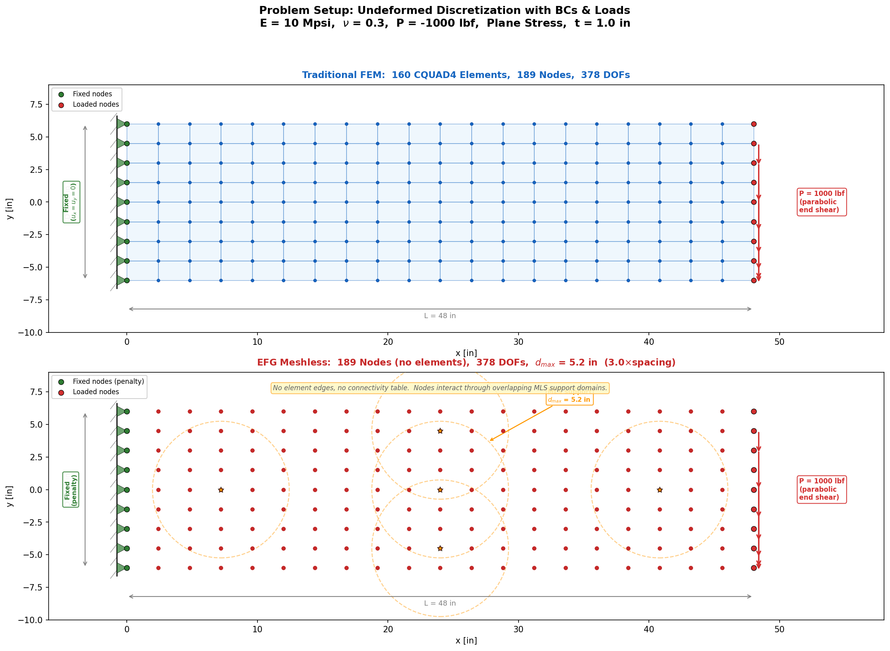
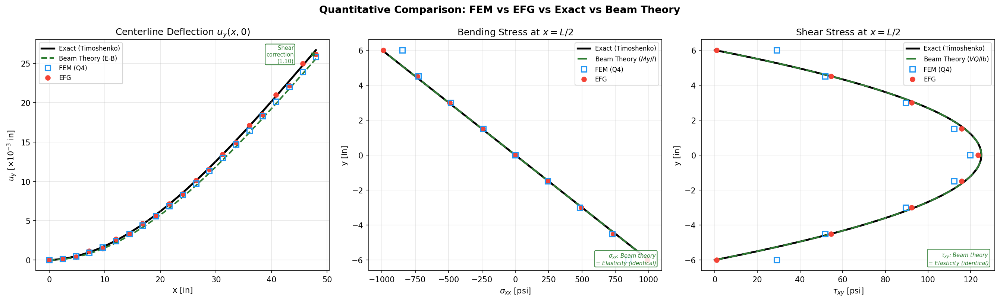
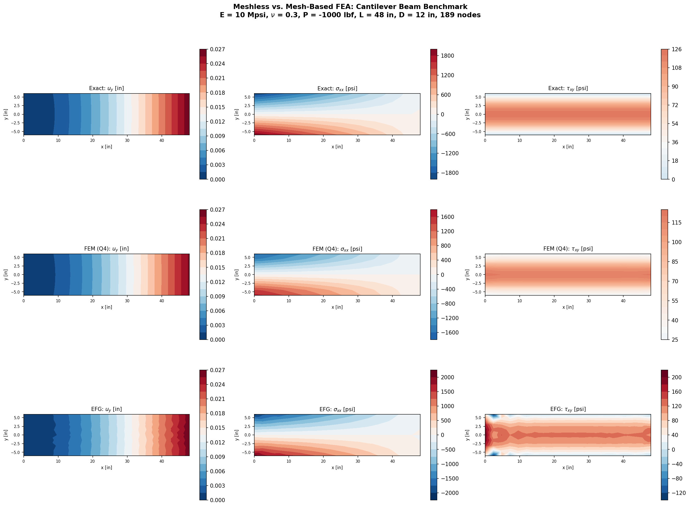
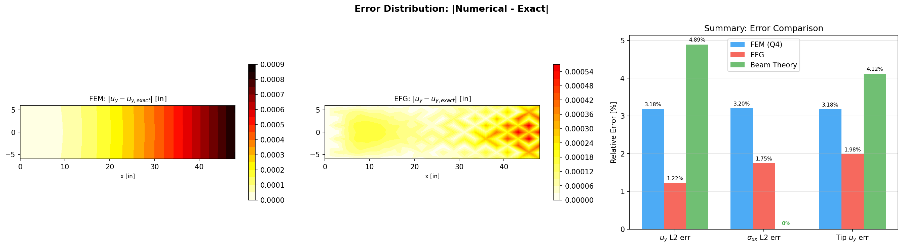
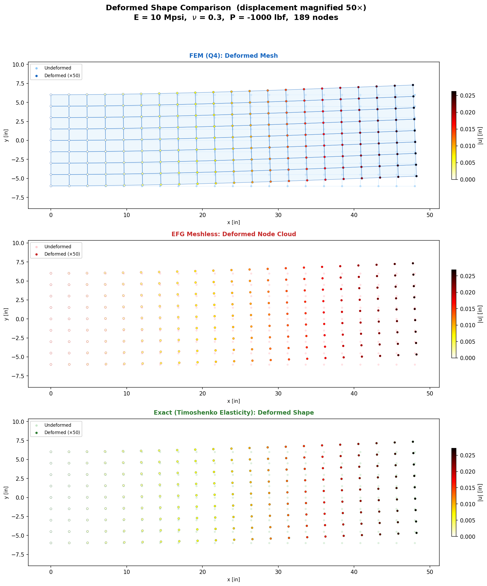

# meshless-vs-fem

Side-by-side comparison of traditional FEM (bilinear Q4) and Element-Free Galerkin (EFG) meshless solvers on a Timoshenko cantilever beam benchmark, validated against Simcenter NASTRAN and exact elasticity solutions.



## What This Is

Two 2D plane stress solvers built from scratch in Python, solving the exact same boundary value problem on the exact same node grid:

1. **Traditional FEM** - Bilinear CQUAD4 elements with standard Gauss quadrature, element assembly, and direct stiffness method. The same element formulation used in NASTRAN, ANSYS, and every other production FEA code.

2. **Element-Free Galerkin (EFG)** - A meshless method using Moving Least Squares (MLS) shape functions. No element connectivity, no mesh topology. Nodes interact through overlapping support domains determined by proximity.

Both are compared against:
- **Timoshenko exact elasticity solution** (the ground truth, not beam theory)
- **Euler-Bernoulli beam theory** (the PL³/3EI solution from an undergrad solid mechanics class)
- **Simcenter NASTRAN** (same 160 CQUAD4 / 189 node mesh)

## The Benchmark Problem

A cantilever beam under parabolic end shear (Timoshenko & Goodier, *Theory of Elasticity*, 3rd Ed., Section 2.8):

| Parameter | Value |
|-----------|-------|
| Length | 48 in |
| Depth | 12 in |
| Thickness | 1.0 in (plane stress) |
| Young's modulus | 10 Mpsi |
| Poisson's ratio | 0.30 |
| Applied shear | -1000 lbf (parabolic distribution) |
| Grid | 21 x 9 = 189 nodes |
| Elements (FEM) | 160 CQUAD4 |
| Background cells (EFG) | 160 |

This problem has a closed-form exact solution for the full 2D stress and displacement fields, making it ideal for quantitative validation. The exact solution includes both bending and transverse shear deformation, which Euler-Bernoulli beam theory neglects.

## Results

### Accuracy (vs. Timoshenko Exact Solution)

| Metric | FEM (Q4) | EFG (Meshless) | Beam Theory |
|--------|----------|----------------|-------------|
| L2 displacement error | 3.18% | 1.22% | 4.89% |
| L2 stress error (interior) | 3.20% | 1.75% | 0% (identical) |
| Tip deflection error | 3.18% | 1.98% | 4.12% |
| Tip corner \|u\| | 0.02626 in | 0.02686 in | - |
| Exact tip corner \|u\| | 0.02713 in | 0.02713 in | - |
| NASTRAN tip corner \|u\| | 0.0272 in | - | - |

### Assembly Speed

These are the results I obtained on my local machine:

| | FEM | EFG | Ratio |
|---|-----|-----|-------|
| Stiffness assembly | ~0.02 sec | ~1.7 sec | ~80x slower |
| Linear solve | ~0.003 sec | ~0.003 sec | Same (identical system size) |

The meshless method is more accurate per degree of freedom on this smooth benchmark, but dramatically slower to assemble because it builds MLS shape functions from scratch at every integration point (neighbor search + 3x3 matrix inversion) rather than using precomputed element shape functions. 

### Comparison Plots

**Quantitative line plots (FEM vs EFG vs Exact vs Beam Theory):**



**Contour fields (displacement and stress):**



**Error distributions:**



**Deformed shapes (50x magnification):**




## Running the Code

### Requirements

- Python 3.8+
- NumPy
- Matplotlib

### Usage

```bash
Python-EFG-FEM-Benchmark .py
```

This generates all plots and prints detailed comparison tables to the console, including node-by-node results along the beam centerline and top fiber for direct comparison with NASTRAN nodal queries.

### Output Files

| File | Description |
|------|-------------|
| `problem_setup.png` | Undeformed mesh (FEM) and node cloud (EFG) with BCs and loads |
| `comparison_contours.png` | 3x3 contour grid: exact / FEM / EFG for uy, sigma_xx, tau_xy |
| `comparison_line_plots.png` | Centerline deflection, bending stress, and shear stress profiles |
| `comparison_errors.png` | Error distribution maps and summary bar chart |
| `deformed_shapes.png` | Deformed shapes for FEM, EFG, and exact (50x magnification) |

## How It Works

### FEM Solver

Standard direct stiffness method:
1. Generate bilinear Q4 element connectivity from node grid
2. Loop over elements, compute element stiffness via 2x2 Gauss quadrature
3. Assemble into global K using element connectivity (guide vectors)
4. Apply BCs via penalty method (exact Timoshenko displacements at x=0)
5. Solve Ku = F
6. Recover stresses at element centroids, average to nodes

### EFG Solver

Element-Free Galerkin with Moving Least Squares:
1. Generate background integration cells (same grid as FEM elements, but carrying no connectivity information)
2. At each Gauss point in each background cell:
   - Find all nodes within the support radius d_max
   - Build the MLS moment matrix A(x) and compute shape function values/derivatives
   - Assemble contributions to global K from all neighbor pairs
3. Apply BCs via penalty method
4. Solve Ku = F
5. Recover stresses by evaluating MLS derivatives directly at nodes

The key difference: FEM shape functions are defined by element connectivity (looked up from a table). EFG shape functions are defined by node proximity (computed on the fly at every evaluation point).

## References

1. Timoshenko, S.P. & Goodier, J.N. (1970) *Theory of Elasticity*, 3rd Ed., McGraw-Hill. Section 2.8.
2. Belytschko, T., Lu, Y.Y., Gu, L. (1994) "Element-Free Galerkin Methods." *Int. J. Numer. Meth. Engng.*, 37, 229-256.
3. Liu, G.R. (2010) *Meshfree Methods: Moving Beyond the Finite Element Method*, 2nd Ed., CRC Press.
4. Bergstrom, J. (2022) "FEA in 100 Lines of Python" (GPL v2). Adapted from [https://github.com/Jorgen-Bergstrom/Full_FE_Solver_100_Lines_Python](https://github.com/Jorgen-Bergstrom/Full_FE_Solver_100_Lines_Python)
## License

MIT License. See [LICENSE](LICENSE) for details.
